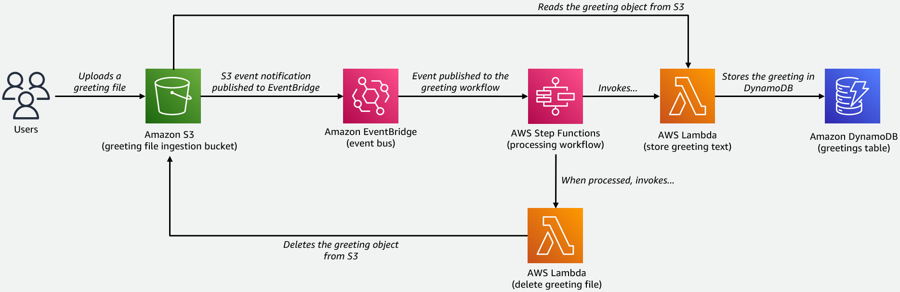
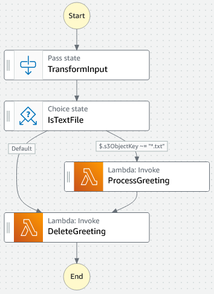

## Serverless Grettings Lab

In this (micro) lab, we're going to build an event-driven Serverless greetings processor. When created, we will have the following architecture in place:



... and we will be able to upload greeting files (samples included in `/sample-greetings`) for processing by our event-driven application.

For simplicity, the application is written in a single CloudFormation (CFN) template located in [serverless-greetings-stack.yml](serverless-greetings-stack.yml).

## Deployment Instructions

To deploy the stack, we have multiple options including the AWS CLI, AWS SDK and the AWS Managment Console.

**Using the AWS CLI**
```
aws cloudformation create-stack --stack-name serverless-greetings-stack --template-body file://serverless-greetings-stack.yml --capabilities CAPABILITY_IAM
```
Docs: https://awscli.amazonaws.com/v2/documentation/api/latest/reference/cloudformation/create-stack.html

**Using the AWS SDK for PowerShell**
```
New-CFNStack -StackName serverless-greetings-stack -TemplateBody (Get-Content .\serverless-greetings-stack.yml -Raw) -Capability CAPABILITY_IAM
```
Docs: https://docs.aws.amazon.com/powershell/latest/reference/items/New-CFNStack.html

**Using the AWS Management Console**

1. Download the raw [serverless-greetings-stack.yml](serverless-greetings-stack.yml) file to your machine
2. Go to the CloudFormation service
3. Select 'Create stack', then select 'With new resources (standard)'
4. Under _Prerequisite - Prepare template_, select 'Template is ready'
5. Under _Specify template_, select 'Upload a template file', then 'Choose file'
6. Select the [serverless-greetings-stack.yml](serverless-greetings-stack.yml) file downloaded in step 1, then select 'Next'
7. Enter a stack name, i.e., `serverless-greetings-stack`, then select 'Next'
8. Leave the _Configure stack options_ and _Advanced options_ with their default values, then select 'Next'
9. Finally, in the _Review_ screen, scroll to the bottom and put a checkmark ✔ in: _[ ] I acknowledge that AWS CloudFormation might create IAM resources._.
10. Select 'Create stack'

The CloudFormation stack is now created and its state is `CREATE_IN_PROGRESS`. When all resources are created, the state should be: `CREATE_COMPLETE`.

## Tutoral: How To Process Greetings

In the repository, there are a few sample greeting files located in `/sample-greetings`. Upload some, or all of them, to the greetings S3 bucket created. The name of bucket follows the following pattern:

`serverless-greetings-bucket-<AWS_ACCOUNT_ID>-<AWS_REGION>`

Example:

`serverless-greetings-bucket-123456789012-eu-west-1`

When one or more greetings are added to the greetings bucket, `Object Created` events are emitted (one per object) to EventBridge on the default event bus. In EventBridge, a rule is matched, which sends each event through to the registered target, which is our greeting-processing workflow represented by an AWS Step Functions State Machine.

The state machine looks like this:



The state machine first extracts the object key (filename of the greeting) from the event message we have got from S3 (via EventBridge). The structure of the event emitted by S3 into EventBridge is [documented here](https://docs.aws.amazon.com/AmazonS3/latest/userguide/ev-events.html).

After that, a `Choice state` is used to check if we have been provided a `.txt` file or not:

- If we have got a `.txt` file, the workflow then processes the greeting by invoking the Lambda function `ProcessGreeting`. This function simply reads the greeting from S3 and stores it in the DynamoDB table (`serverless-greetings`). When processing of the greeting has completed, the greeting is deleted from S3 by the `DeleteGreeting` Lambda function.

- On the other hand - if we have been provided with any other file type, i.e., a `.json` file, we simply short-circuit the workflow and delete the greeting from S3. Deletion of the object is done by the `DeleteGreeting` Lambda function.

Assuming you have processed greetings as `.txt` files, you should now be able to see the content of these greetings in the `serverless-greetings` DynamoDB table (plus a few other attributes added by the `ProcessGreeting` Lambda function).

This concludes the tutorial.

## Clean Up
We use CloudFormation to clean up and remove the resources created in the `serverless-greetings-stack`:

1. Go to CloudFormation
2. Select the stack (`serverless-greetings-stack`), then select 'Delete', and confirm by selecting 'Delete stack'
3. CloudFormation now removes all of the resources

## Wrapping Up
In this micro lab, we have been playing with a tiny event-driven application powered by Serverless technologies in the AWS Cloud. I hope you have found it interesting to follow along. If you have any input, find bugs, and so on - please feel free to raise an issue or submit a pull-request :)